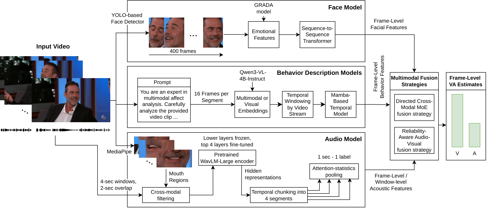

# Team RAS in the 10th ABAW Competition: Multimodal Valence and Arousal Estimation Approach

Official repository of the team RAS for the **10th ABAW Valence/Arousal Estimation Challenge**. The repository describes a multimodal valence/arousal estimation approach that combines **face**, **behavior**, and **audio** modalities, and reports a CCC of **0.658** on the development set of the Aff-Wild2 dataset. 

Each top-level source folder is a standalone project focused on one part of the general pipeline (see Figure): visual dynamics, behavior modelling, audio modelling or multimodal fusion.




## Repository structure

Although each folder is self-contained, the repository naturally forms a multimodal workflow:

1. Visual features can be extracted and modeled in `src_visual_dynamic_model/`.
2. Behavior descriptions / embeddings can be produced in `src_behavior_description/`.
3. Those embeddings can be trained as a standalone predictor in `src_behavior_model/`.
4. Audio features and Chimera-based multimodal training live in `src_audio_and_fusion/` (RAAV).
5. If you prefer a standalone precomputed-feature fusion setup, use `src_fusion_model/` (DCMMOE).

---

### `src_visual_dynamic_model/`
Dynamic visual valence/arousal model built on cached frame-level visual features.

This project is intended for temporal visual modeling. According to its local README, it includes:
- dataset/index construction from AffWild2-style annotation TXT files;
- cached feature loading from `.npz` files;
- a temporal model (`VisualDynamicModel`);
- CCC-based loss and metrics;
- best-checkpoint selection by validation VA score;
- optional GRADA-based feature extraction from cropped faces;
- export of PKL records and test TXT predictions.

Typical workflow:
1. optionally extract / cache features;
2. train a temporal visual model;
3. export PKLs for downstream fusion or generate a test submission file.

---

### `src_behavior_description/`
Behavior-description extraction with Qwen3-VL.

This folder currently contains a Qwen3-VL-based script that generates natural-language behavior descriptions and embedding packs from video segments. In practice, this branch serves as a way to turn short clips into:
- textual affect descriptions;
- multimodal pooled embeddings;
- text-only pooled embeddings;
- visual pooled embeddings;
- serialized pickle artifacts for later reuse.

---

### `src_behavior_model/`
Valence/arousal regression from precomputed behavior embeddings.

This project trains a model on top of cached behavior embeddings. Its local README describes it as a pipeline for:
- loading precomputed segment-level embeddings (by default Qwen-based embeddings);
- training a regression model for valence/arousal prediction;
- evaluating on validation data;
- saving the best checkpoint and training history.

The default entry point is:

```bash
python src_behavior_model/main.py
```

The main configuration lives in:

```text
src_behavior_model/configs/text_va.toml
```

---

### `src_audio_and_fusion/`
Audio modeling and Chimera-based multimodal fusion pipeline.

This folder contains the most end-to-end training pipeline in the repository. It covers:
- audio extraction from videos;
- sequence window generation;
- filtering windows using speaking / mouth-openness heuristics;
- audio model training and evaluation;
- export of audio features / predictions;
- Chimera ML-based multimodal fusion training and evaluation;
- optional late fusion of several submission folders.


See the local README inside `src_audio_and_fusion/` for the full step-by-step pipeline and expected data layout.

---

### `src_fusion_model/`
Fusion model for precomputed multimodal PKL features.

This project performs feature-level multimodal fusion when each modality has already exported `train.pkl`, `val.pkl`, and `test.pkl`. The local README expects each PKL to contain records keyed by frame path, with embeddings, predictions, and labels.

This folder is useful when you already have several independent modality outputs and want to train a dedicated fusion architecture over them. It provides:
- fusion-model training;
- optional search / grid search over fusion settings;
- test submission generation from a trained checkpoint.

This is the standalone multimodal fusion baseline outside the Chimera-based `src_audio_and_fusion` pipeline.


## Citation

If you use this repository, please cite the paper:

Ryumina E., Markitantov M., Axyonov A., Ryumin D. Dolgushin M., Dresvyanskiy D., Karpov A. [Team RAS in 10th ABAW Competition: Multimodal Valence and Arousal Estimation Approach](https://arxiv.org/abs/2603.13056) // arXiv preprint arXiv:2603.13056, 2026.

or

```bibtex
@article{ryumina2026team,
  title={Team RAS in 10th ABAW Competition: Multimodal Valence and Arousal Estimation Approach},
  author={Ryumina, Elena and Markitantov, Maxim and Axyonov, Alexandr and Ryumin, Dmitry and Dolgushin, Mikhail and Dresvyanskiy, Denis and Karpov, Alexey},
  journal={arXiv preprint arXiv:2603.13056},
  year={2026},
  doi={10.48550/arXiv.2603.13056}
}
```